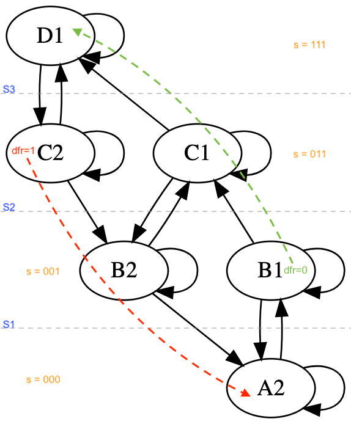

# Explicação

Veja o enunciado na [página do exercício](https://hdlbits.01xz.net/wiki/Exams/ece241_2013_q4). Apesar de termos 3 entradas em `s`, nem todas as combinações são válidas, apenas `000`, `001`, `011` e `111`. Se considerarmos só os níveis do reservatório, temos apenas 4 estados, mas há um detalhes sobre o nível anterior que faz necessário replicar os níveis intermediários. 

