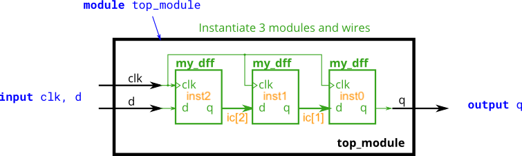

# Explicação

Após submeter sua solução, veja a [solução do site](https://hdlbits.01xz.net/wiki/Module_shift) e compare as diferenças. [Nesta aqui](module_shift.v) foi declarado um vetor de 2 bits ao invés de dois fios separados. As instâncias têm nomes indexados e a ordem está ao contrário (isso não interfere em nada). Isso foi feito para possibilitar uma possível saída paralela posteriormente. 

Antes de codificar qualquer coisa mais ou menos complexa em Verilog é preciso fazer um desenho esquemático do que se deseja obter. Assim, o projeto propriamente dito é feito antes e a codificação se torna mais simples, pois é apenas uma transcrição do que já foi pensado. É importante incluir o máximo de detalhes no desenho, principalmente nomes de instâncias e fios. 

Figura adaptada [daqui](https://hdlbits.01xz.net/wiki/File:Module_shift.png).

P.S.: Este exercício trata da instanciação de módulos e ligações entre eles, mas a compreensão completa do seu funcionamento depende de conhecimentos de circuitos sequenciais, abordados no [segunda parte da disciplina](https://github.com/menotti/ld#dura%C3%A7%C3%A3o-dos-t%C3%B3picos). 

