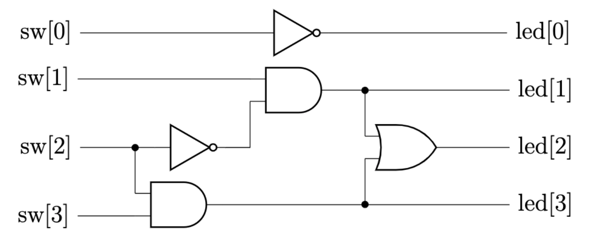
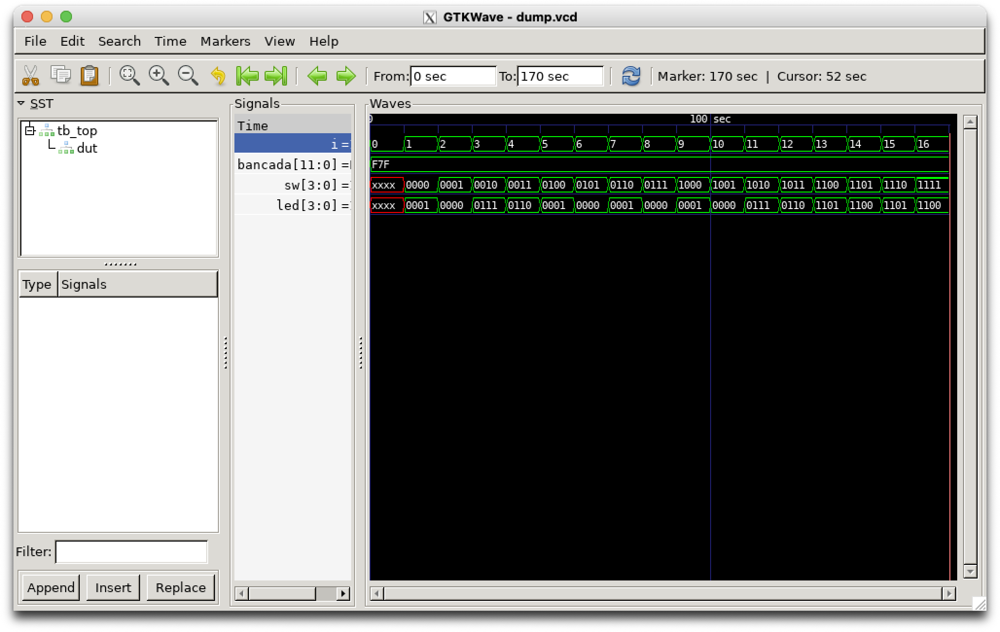

[](https://codespaces.new/menotti/ld)

# Test bench

Nesta prática vamos usar o [Icarus Verilog](https://steveicarus.github.io/iverilog/) para fazer uma simulação e apresentar o seu resultado na console e no [GTKWave](https://gtkwave.sourceforge.net/) ou [WaveTrace](https://marketplace.visualstudio.com/items?itemName=wavetrace.wavetrace).

## Instalação

Abra um terminal no Linux e digite o seguinte comando para instalar os pacotes necessários:

`sudo apt update && sudo apt install iverilog gtkwave`

## Comandos básicos 

### Clonando o repositório

O comando a seguir criará uma cópia local do repositório:

`git clone https://github.com/menotti/ld.git`

### Acessando um diretório 

Para acessar o diretório da prática digite:

`cd ld/labs/03_leds`

Ao digitar o caminho desejado, você pode usar a tecla `TAB` para completá-lo automaticamente.

### Fazendo a implementação da função

A implementação original da função apenas liga cada *switch* com o respectivo LED. 

```verilog
module top(
	input [3:0] sw, 
	output [3:0] led);

	assign led = sw;
	//assign led[0] = ~sw[0];
endmodule
```

Use a sintaxe do comentário para atribuir cada LED com sua respectiva função, conforme apresentado no diagrama esquemático:




### Inspecionando o *test bench* (`tb_top.v`)

O *test bench* a seguir instancia o módulo a ser testado (`dut`) e o estimula com todas as combinações possíveis de entrada. 

Observe que para as entradas `sw` criamos um `reg`, pois precisamos atribuir valores a elas. Já para as saídas `led` precisamos apenas de fios `wire` para receber os valores calculado internamente. 

```verilog
module tb_top;
	wire [3:0] led;
	reg [3:0] sw;

	integer i;
	reg [11:0] bancada = 12'hF7F; // Modificar

	top dut(sw, led);

	initial 
	begin
		$dumpfile("dump.vcd");
		$dumpvars(0);
		
		$display("Linhas totais: %0d", 2**$bits(led));
		$monitor("%b %b", sw, led);

		for (i = 0; i < (2**$bits(led)); i++)
			#10 sw = i;
		#10 $finish;
	end
endmodule
```

### Inspecionando o `Makefile`

```make
CC = iverilog 
FLAGS = -Wall
VIEWER = gtkwave
all: *.v
	$(CC) $(FLAGS) *.v 
	vvp a.out
	$(VIEWER) dump.vcd config.gtkw
```

### Saída esperada (`make`)

```
menotti@vlab:~/Workspace/ld/labs/03_leds$ make
iverilog  -Wall *.v 
vvp a.out
VCD info: dumpfile dump.vcd opened for output.
Linhas totais: 16
                   0 xxxx xxxx
                  10 0000 0001
                  20 0001 0000
                  30 0010 0111
                  40 0011 0110
                  50 0100 0001
                  60 0101 0000
                  70 0110 0001
                  80 0111 0000
                  90 1000 0001
                 100 1001 0000
                 110 1010 0111
                 120 1011 0110
                 130 1100 1101
                 140 1101 1100
                 150 1110 1101
                 160 1111 1100
gtkwave dump.vcd config.gtkw

GTKWave Analyzer v3.3.104 (w)1999-2020 BSI

[0] start time.
[170] end time.
```

### Imagem da simulação

