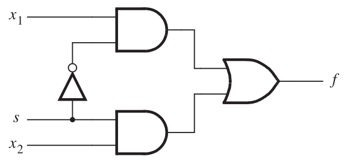

# Multiplexador de 3 entradas

O objetivo deste laboratório é implementar um multiplexador de três entradas de duas formas distintas em Verilog, e verificar seu funcionamento com um *test bench*.

## Fundamentos teóricos

### Multiplexador de duas entradas (mux2)

Um multiplexador de duas entradas seleciona uma das entradas (`x1` ou `x2`) com base no sinal de seleção `s`:

**Circuito**



**Tabela verdade simplificada**

| s | f  |
|:-:|:--:|
| 0 | x1 |
| 1 | x2 |

**Código Verilog funcional**

```verilog
module mux2(
    input x1, x2, s,
    output f);
    assign f = s ? x2 : x1;
endmodule
```

### Multiplexador de três entradas (mux3)

Um multiplexador de três entradas seleciona uma dentre três entradas (`x1`, `x2`, `x3`) usando dois sinais de seleção (`s0` e `s1`). Há quatro variantes neste laboratório, com tabelas verdade distintas:

<table>
<tr>
<td>

**Variante A**

| s1 | s0 | f  |
|:--:|:--:|:--:|
| 0  | 0  | x1 |
| 0  | 1  | x2 |
| 1  | x  | x3 |

</td>
<td>

**Variante B**

| s1 | s0 | f  |
|:--:|:--:|:--:|
| 0  | 0  | x3 |
| 0  | 1  | x2 |
| 1  | x  | x1 |

</td>
</tr>
<tr>
<td>

**Variante C**

| s0 | s1 | f  |
|:--:|:--:|:--:|
| 0  | 0  | x1 |
| 0  | 1  | x2 |
| 1  | x  | x3 |

</td>
<td>

**Variante D**

| s0 | s1 | f  |
|:--:|:--:|:--:|
| 0  | 0  | x3 |
| 0  | 1  | x2 |
| 1  | x  | x1 |

</td>
</tr>
</table>

## Implementação

O arquivo `top.v` (nomeado `topA.v`, `topB.v`, etc. conforme a variante) contém três módulos a serem preenchidos:

```verilog
module top (
    input x1, x2, x3, s0, s1,
    output xfe, xff);
    mux3e dute(x1, x2, x3, s0, s1, xfe);  // saída estrutural
    mux3f dutf(x1, x2, x3, s0, s1, xff);  // saída funcional
endmodule
```

### mux3e — Verilog Estrutural

Implemente o `mux3e` instanciando e conectando módulos `mux2`. A ideia é usar dois multiplexadores de duas entradas em cascata para obter a seleção entre três entradas.

```verilog
module mux3e (
    input x1, x2, x3, s0, s1,
    output f);
    // Instancie e conecte os componentes abaixo

endmodule
```

### mux3f — Verilog Funcional

Implemente o `mux3f` diretamente com a expressão lógica correspondente à tabela verdade da sua variante.

```verilog
module mux3f (
    input x1, x2, x3, s0, s1,
    output f);
    // Digite o seu código abaixo

endmodule
```

## Verificação

Use o test bench para verificar o correto funcionamento do seu projeto;

Para compilar e verificar sua implementação, use o script `run.sh` passando a letra da sua variante:

```bash
./run.sh A   # substitua A pela sua variante (A, B, C ou D)
```