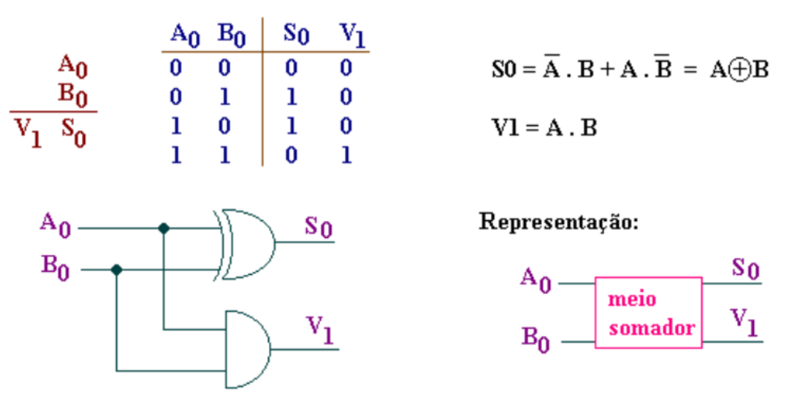
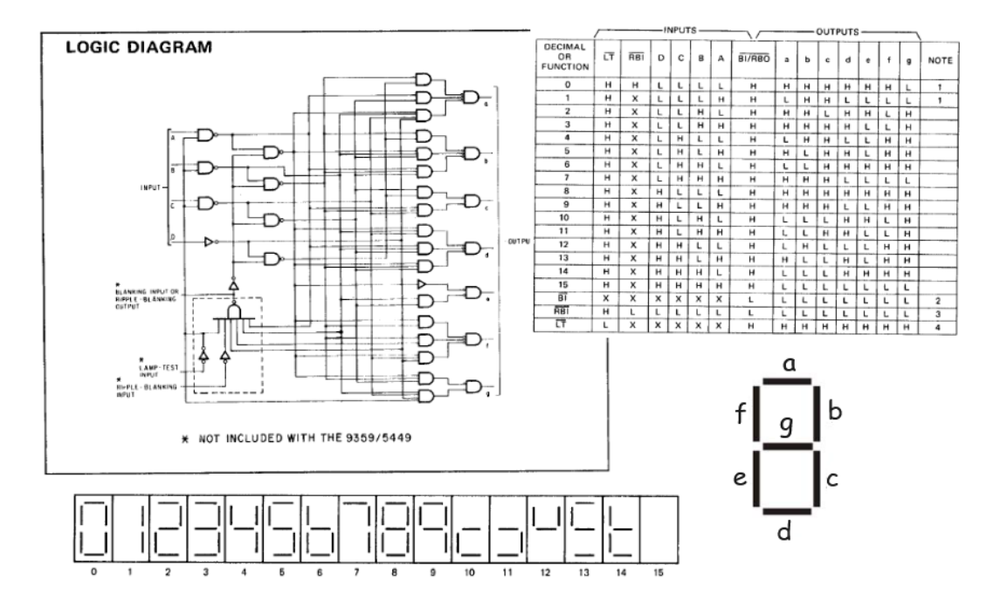
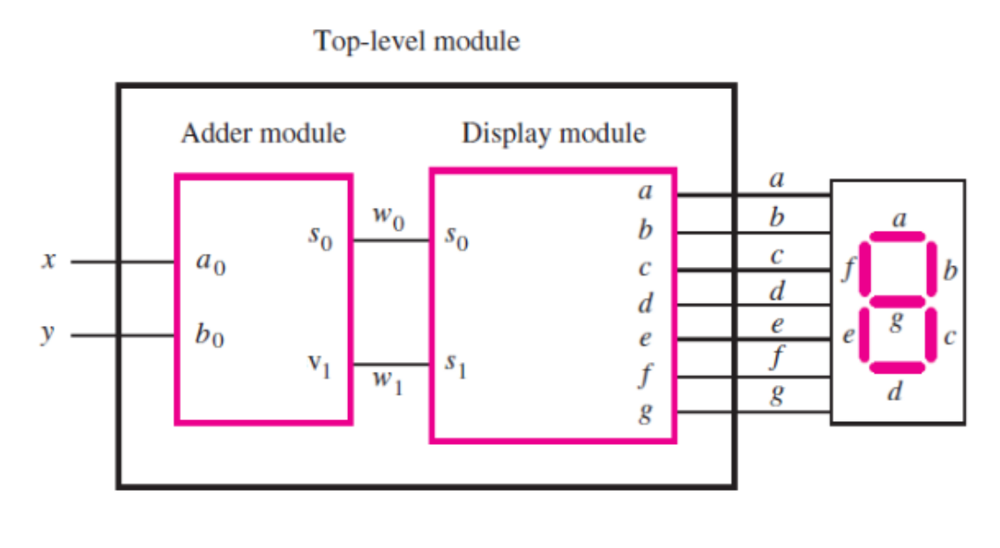

# Somador de 1 bit com saída em display

O objetivo deste laboratório é implementar um somador de 1 bit utilizando o display de 7 segmentos como saída, praticando a criação de hierarquia de módulos e sintetizando o projeto na placa FPGA.

## Fundamentos teóricos

### Meio somador (`adder`)

O meio somador recebe dois bits de entrada e produz a soma (`s0`) e o carry (`v1`):



**Código Verilog**

```verilog
module adder(
    input a0, b0,
    output s0, v1);

    assign s0 = a0 ^ b0;
    assign v1 = a0 & b0;
endmodule
```

---

### Display de 7 segmentos (`display`)

O módulo `display` decodifica os dois bits resultantes da soma (`s0`, `s1`) para os segmentos do display. A decodificação cobre apenas os valores possíveis: 00, 01, 10 e 11.



**Código Verilog**

```verilog
module display(
    input s0, s1,
    output a, b, c, d, e, f, g);

    assign a = ~s0;
    assign b = 1'b1;
    assign c = ~s1;
    assign d = ~s0;
    assign e = ~s0;
    assign f = ~s1 & ~s0;
    assign g = s1 & ~s0;
endmodule
```

---

### Módulo top-level (`top`)

O módulo `top` conecta o `adder` ao `display`. As saídas do somador (`s0` → `w0`, `v1` → `w1`) alimentam as entradas do display:



**Template (`top.v`)**

```verilog
module top(
    input [1:0] SW,     // x e y
    output [6:0] HEX0); // a, b, c, d, e, f, g

    // instancie e conecte os módulos a seguir

endmodule
```

## Implementação

1. Crie o arquivo `adder.v` e implemente o módulo meio somador.
2. Crie o arquivo `display.v` e implemente o módulo de decodificação para o display.
3. Complete o arquivo `top.v` instanciando e conectando os dois módulos.
4. Carregue o código para a placa FPGA.