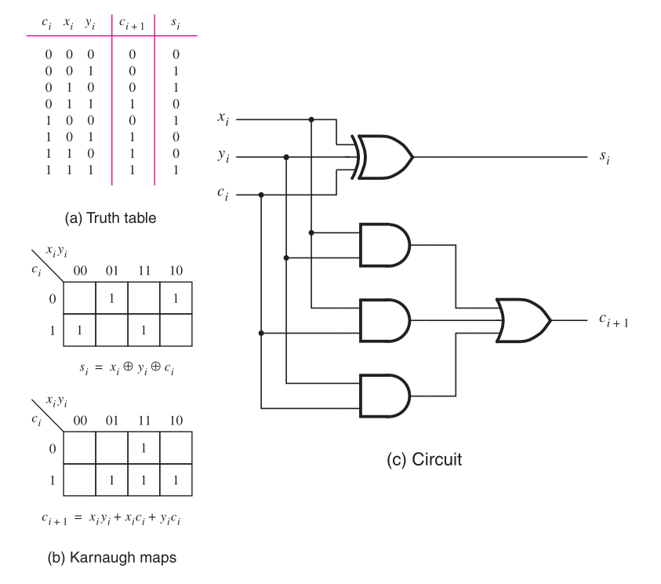

# Somador de 3 bits com overflow

O objetivo deste laboratório é implementar e testar um somador de 3 bits com detecção de *overflow*, verificando seu funcionamento por simulação e sintetizando o projeto na placa FPGA.

## Fundamentos teóricos

### Somador completo (`full_adder`)

Para realizar uma soma binária de múltiplos bits é necessário que cada bit seja computado por um somador completo, capaz de receber o *vem um* da soma anterior e de propagar o *vai um* para o próximo bit:



**Código Verilog**

```verilog
module full_adder(
    input Cin, X, Y,
    output S, Cout);
    assign S = X ^ Y ^ Cin;
    assign Cout = (X & Y) | (Cin & X) | (Cin & Y);
endmodule
```

---

### Somador de N bits (*ripple-carry adder*)

É possível construir um somador binário de um número arbitrário de bits encadeando vários somadores de um bit. Neste esquema, o *carry* do LSB é recebido como entrada e os demais propagados para os bits seguintes:


Também é necessário calcular o *overflow*, quando o resultado da soma excede o campo de representação (no nosso caso, 3 bits). Esta saída pode ser apenas o último *carry* para números sem sinal, ou calculada por uma função XOR entre os dois sinais *carry* mais significativos ($C_n \oplus C_{n-1}$) para números com sinal em complemento de 2.

---

### Decodificador de 7 segmentos (`dec7seg`)

Converte um valor hexadecimal de 4 bits (0–F) nos segmentos do display. Se o resultado da soma for maior que 7 (*overflow*), o display 1 deve exibir **E** de erro.


## Implementação

A partir do somador de 3 bits fornecido, teste seu funcionamento por simulação e depois na placa. Se a soma ficar dentro do campo de representação (0 a 7) ela deve ser mostrada no display 0. Se der *overflow*, o display 1 deve exibir **E**, sinalizando o erro.

1. Importe os arquivos fornecidos e complete o que for necessário.
2. Faça a simulação do somador acrescentando outros casos de teste com/sem *carry* e com/sem *overflow*. Note que até aqui o somador é o top-level do projeto e que já existem casos de teste disponí­veis.
3. Crie um novo arquivo para ser o top-level e fazer a interface com a placa.
4. Configure os pinos da placa:
   - `Cin` → `KEY[0]`
   - Entrada `X` → `SW[2]`, `SW[1]`, `SW[0]`
   - Entrada `Y` → `SW[9]`, `SW[8]`, `SW[7]`
5. Carregue o código para a placa FPGA.
