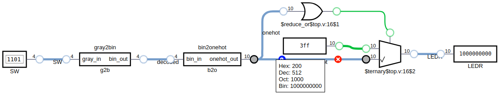

# Jogo em Código Gray

O objetivo deste laboratório é construir um jogo simples onde o jogador precisa fazer um LED caminhar na placa, informando uma sequência correta nos *switch buttons* em código gray. 

## Código Gray

No código Gray, apenas um bit muda por vez, o que evita erros em sistemas onde a leitura intermediária entre bits pode gerar valores incorretos (veremos isso mais adiante).

## Código One-hot

Na codificação One-hot, apenas um bit é setado por vez e os demais são zerados. Isso facilita a depuração de circuitos e simplifica a sua lógica, embora aumente o número de bits necessários. 

## Funcionamento

O jogo começa com todos os *switches* desligados, o que deve fazer com que apenas o primeiro LED se acenda (LSB). A seguir, o jogador deve ir mudando um *switch* de cada vez (obviamente sem olhar a tabela) para que o LED avance uma posição de cada vez até chegar no último (MSB).

|Decimal|Binário|Gray (SW)|One-Hot (LEDs)[^1]|
|------:|:-----:|:-------:|:------------:|
| 0|`0000`|**`0000`**|`0000000001`|
| 1|`0001`|**`0001`**|`0000000010`|
| 2|`0010`|**`0011`**|`0000000100`|
| 3|`0011`|**`0010`**|`0000001000`|
| 4|`0100`|**`0110`**|`0000010000`|
| 5|`0101`|**`0111`**|`0000100000`|
| 6|`0110`|**`0101`**|`0001000000`|
| 7|`0111`|**`0100`**|`0010000000`|
| 8|`1000`|**`1100`**|`0100000000`|
| 9|`1001`|**`1101`**|`1000000000`|
|10|`1010`|  `1111`  |`1111111111`|
|11|`1011`|  `1110`  |`1111111111`|
|12|`1100`|  `1010`  |`1111111111`|
|13|`1101`|  `1011`  |`1111111111`|
|14|`1110`|  `1001`  |`1111111111`|
|15|`1111`|  `1000`  |`1111111111`|

[^1]: como só vamos usar 10 bits, qualquer conversão acima disso deve acender todos os LEDs. 

## Implementação 

Os conversores de código necessários para a implementação estão disponíveis, então você só precisa:

1. Juntar as partes fornecidas;
1. Tratar as conversões que resultariam em mais de 10 bits;
1. Implementar na placa e jogar. 🤓

Veja o exemplo do circuito realizando a última conversão válida (linha 9 da tabela fornecida):

Agora, veja o que deve acontecer quando ele converte um número inválido (todos os LEDs acessos):

