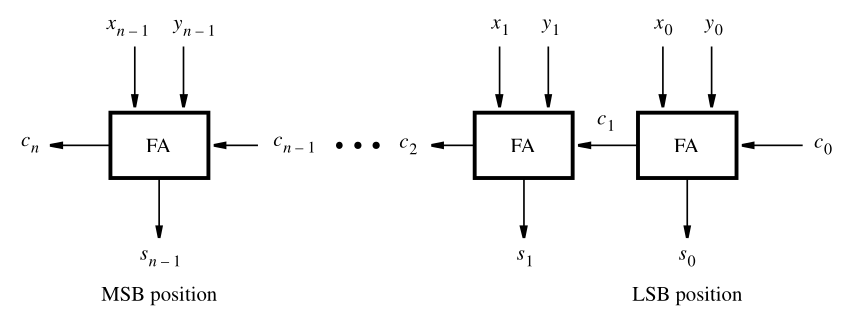
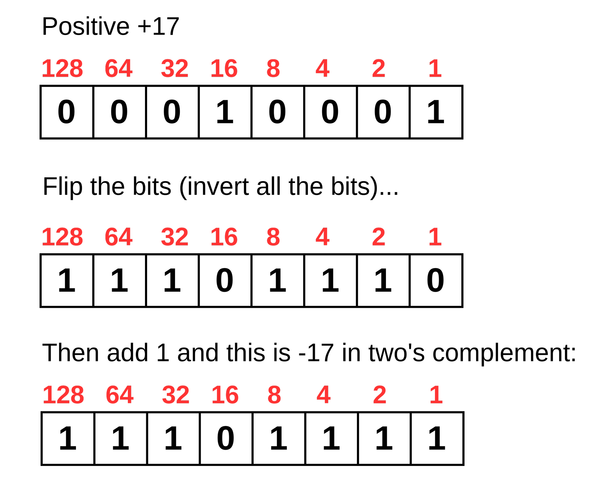

# Somador/Subtrator de 4 bits com sinal

O objetivo deste laboratório é implementar e testar um somador/subtrator de 4 bits com sinal **a partir de um somador fornecido**, verificando seu funcionamento por simulação e sintetizando o projeto na placa FPGA.

## Fundamentos teóricos

### Somador completo (`full_adder`)

Cada bit da soma é computado por um somador completo, que recebe o *vem um* (`Cin`) do bit anterior e propaga o *vai um* (`Cout`) para o próximo:


**Código Verilog**

```verilog
module full_adder(
    input Cin, X, Y,
    output S, Cout);
    assign S = X ^ Y ^ Cin;
    assign Cout = X & Y | Cin & (X ^ Y);
endmodule
```

---

### Somador de 4 bits (`sum4bits`)

Encadeando quatro somadores completos obtemos um somador *ripple-carry* de 4 bits. O *carry* de cada estágio alimenta o estágio seguinte:



Como os operandos são **com sinal** (complemento de 2, faixa de -8 a +7), o *overflow* não é o último *carry*, e sim o XOR entre os dois *carries* mais significativos ($C_3 \oplus C_2$):

**Código Verilog**

```verilog
module sum4bits (
  input cin,
  input signed [3:0] x, y,
  output signed [3:0] s,
  output ov);

  wire C[3:0];

  full_adder b0 ( cin, x[0], y[0], s[0], C[0]);
  full_adder b1 (C[0], x[1], y[1], s[1], C[1]);
  full_adder b2 (C[1], x[2], y[2], s[2], C[2]);
  full_adder b3 (C[2], x[3], y[3], s[3], C[3]);

  assign ov = C[2] ^ C[3];
endmodule
```

---

### Subtração em complemento de 2

Em complemento de 2, o oposto de um número é obtido invertendo todos os seus bits e somando 1:



Logo, subtrair é somar o oposto: $X - Y = X + (\overline{Y} + 1)$. Ou seja, basta **inverter os bits de `Y`** e **somar 1**, sem precisar de um circuito subtrator separado.

Os dois ajustes podem ser feitos reaproveitando o `sum4bits`:

| `op` | Operação | Entrada `y` do somador | Entrada `cin` |
|:----:|:--------:|:----------------------:|:-------------:|
| 0    | X + Y    | `y`                    | 0             |
| 1    | X − Y    | `~y`                   | 1             |

A inversão condicional se resolve com uma porta XOR por bit (`y ^ op`), já que `y ^ 0 = y` e `y ^ 1 = ~y`. O "+1" vem de graça ligando o próprio `op` no `cin`.

---

### Decodificador de 7 segmentos (`dec7seg`)

Converte um valor hexadecimal de 4 bits (0–F) nos segmentos do display. É usado tanto para mostrar os operandos e o resultado quanto para escrever `Erro` em caso de *overflow*:

**Código Verilog**

```verilog
module dec7seg (
    input  [3:0] hex,
    output reg [6:0] segs); // some boards use active low, so you may need to invert the output
    always @(hex)        // gfedcba
      case (hex)         // 6543210
        4'b0000 : segs = 7'b0111111; // 0
        4'b0001 : segs = 7'b0000110; // 1
        // ...
        4'b1110 : segs = 7'b1111001; // E
        4'b1111 : segs = 7'b1110001; // F
      endcase
endmodule
```

## Funcionamento na placa

Deseja-se implementar um Somador/Subtrator de 4 bits utilizando como saída o valor em hexadecimal nos displays de sete segmentos. O sistema deve ter as seguintes características:
- O *switch* `SW[9]` escolhe entre Soma=0 e Subtração=1;
- Os *switches* `SW[8:5]` e `SW[4:1]` informam os operandos X e Y respectivamente;
- Em caso de *overflow*, o *switch* `SW[0]` escolhe entre mostrar "Erro"=0 ou as Entradas=1 que o geraram;
- Os 4 dígitos mais à esquerda mostram as entradas ou "Erro", dependendo de `SW[0]`;
- Os 2 dígitos mais à direita mostram sempre o resultado da operação;
- Os LEDs acendem todos em caso de erro;

## Implementação

### Etapa 1 — Somador/subtrator (`addsub4bits.v`)

Implemente o módulo instanciando o `sum4bits` fornecido e aplicando a técnica de complemento de 2 descrita acima. Não é necessário reescrever a lógica de soma:

```verilog
module addsub4bits (
  input op,
  input signed [3:0] x, y,
  output signed [3:0] s,
  output ov);

  // 1. Implemente aqui o somador/subtrator aqui e simule para testar


endmodule
```

### Etapa 2 — Top-level para a placa (`top.v`)

Complete o `top` instanciando o `addsub4bits` e os decodificadores `dec7seg` necessários, seguindo o mapeamento de pinos descrito em *Funcionamento na placa*:

```verilog
module top(
  input [9:0] SW, // op=SW[9], x=SW[8:5], y=SW[4:1], "Erro" | res=SW[0]
  output [9:0] LEDR, // todos acessos em caso de erro
  output [6:0] HEX5, HEX4, HEX3, HEX2, HEX1, HEX0); // x | "Er" =HEX[5:4], y | "ro" =HEX[3:2], res=HEX[1:0]

  // 2. Instancie o somador/subtrator aqui para por no kit de FPGA


endmodule
```

Depois, carregue o código para a placa FPGA. 🚀
