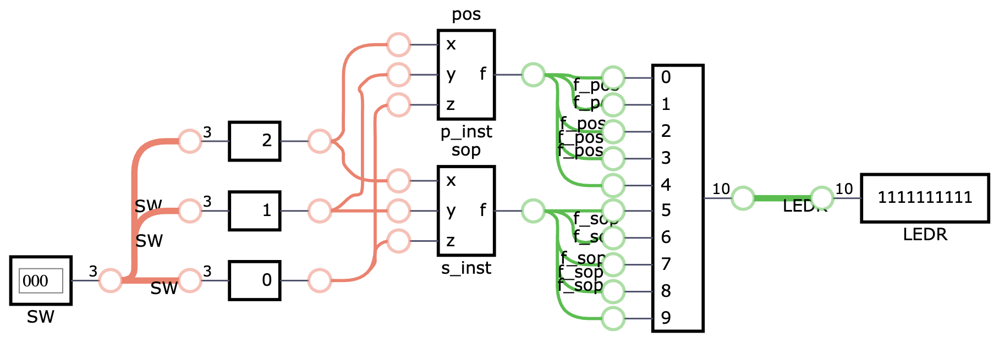

# Comparando duas funções lógica equivalentes (POS e SOP)

O objetivo deste laboratório é comparar duas implementações equivalentes de uma mesma função lógica. A partir do [módulo fornecido](pos.v) (POS), implemente um equivalente na forma de SOP. Depois coloque ambos no kit FPGA para comparar suas saídas. 

## Funcionamento

As entradas das funções lógicas devem ser atribuidas aos **mesmos switches** de 2 a 0 na placa, para que as funções lógicas recebam sempre as mesmas entradas.

Suas saídas devem ser atribuidas aos LEDs, de forma que a metade deles receba o resultado de uma função e a outra metade receba o resultado da outra. Use o operador de replicação `{{}}` para acender mais de um LED a partir do mesmo *drive*. 
