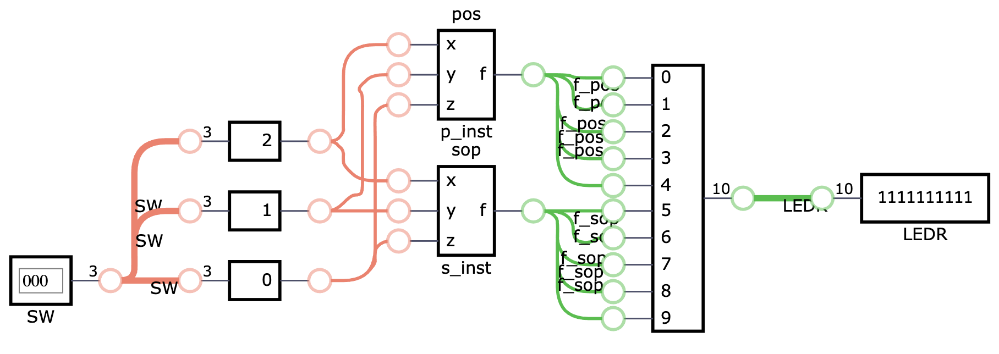

# Comparando duas funções lógicas equivalentes (POS e SOP)

O objetivo deste laboratório é comparar duas implementações equivalentes de uma mesma função lógica. A partir do [módulo fornecido](pos.v) (POS), implemente um equivalente na forma de SOP. Depois coloque ambos no kit FPGA para comparar suas saídas.

## Fundamentos teóricos

### Tabela verdade da função

Toda função lógica pode ser escrita de duas formas canônicas: como um **produto de somas** (POS) ou como uma **soma de produtos** (SOP). As duas descrevem exatamente a mesma tabela verdade, e é isso que este laboratório vai comprovar na prática.

A função deste experimento é:

| x | y | z | f |
|:-:|:-:|:-:|:-:|
| 0 | 0 | 0 | **1** |
| 0 | 0 | 1 | 0 |
| 0 | 1 | 0 | 0 |
| 0 | 1 | 1 | **1** |
| 1 | 0 | 0 | 0 |
| 1 | 0 | 1 | **1** |
| 1 | 1 | 0 | **1** |
| 1 | 1 | 1 | 0 |

---

### Forma POS — produto de somas (`pos`)

Na forma POS, escrevemos **um termo soma (*maxtermo*) para cada linha em que `f = 0`**, e multiplicamos todos. Dentro de cada termo, a variável aparece **negada quando vale 1** naquela linha:

| Linha com `f = 0` | Maxtermo |
|:-----------------:|:---------|
| x=0, y=0, z=1 | `(x \| y \| ~z)` |
| x=0, y=1, z=0 | `(x \| ~y \| z)` |
| x=1, y=0, z=0 | `(~x \| y \| z)` |
| x=1, y=1, z=1 | `(~x \| ~y \| ~z)` |

Cada termo vale 0 apenas na sua linha, zerando o produto inteiro. Nas demais linhas todos os termos valem 1, e portanto `f = 1`.

**Código Verilog**

```verilog
module pos (
    input x, y, z,
    output f);
    assign f = (x | y | ~z) & (x | ~y | z) & (~x | y | z) & (~x | ~y | ~z);
endmodule
```

---

### Forma SOP — soma de produtos (`sop`)

Na forma SOP vale o raciocínio inverso: escrevemos **um termo produto (*mintermo*) para cada linha em que `f = 1`**, e somamos todos. Dentro de cada termo, a variável aparece **negada quando vale 0** naquela linha.

Olhando a tabela verdade, há quatro linhas com `f = 1` — logo a SOP terá quatro termos produto, um para cada.

---

### Por que esta função?

Duas formas equivalentes nem sempre custam a mesma coisa. Veja esta função de duas variáveis:

| a | b | f |
|:-:|:-:|:-:|
| 0 | 0 | **1** |
| 0 | 1 | **1** |
| 1 | 0 | 0 |
| 1 | 1 | **1** |

**POS** — apenas uma linha tem `f = 0`, então basta um único termo soma:

```verilog
assign f = (~a | b);
```

**SOP** — três linhas têm `f = 1`, então são necessários três termos produto:

```verilog
assign f = (~a & ~b) | (~a & b) | (a & b);
```

As duas expressões produzem exatamente a mesma tabela verdade, mas aqui a POS sai bem mais barata: 1 termo contra 3.

Já a função deste laboratório foi escolhida justamente por **não** favorecer nenhuma das duas formas. Repare no mapa de Karnaugh: as células em 1 nunca são adjacentes, formando um padrão de tabuleiro de xadrez.

|  x \ yz | 00 | 01 | 11 | 10 |
|:-------:|:--:|:--:|:--:|:--:|
| **0**   | 1  | 0  | 1  | 0  |
| **1**   | 0  | 1  | 0  | 1  |

Como não há nenhum par de 1s (ou de 0s) adjacente para agrupar, **nenhuma das duas formas pode ser simplificada**: POS e SOP ficam ambas com 4 termos de 3 literais. Isso torna a comparação justa — as duas versões têm o mesmo custo, e a diferença é só a forma de escrever.

---

### Operador de replicação `{{ }}`

O Verilog permite repetir um sinal N vezes com `{N{sinal}}`, evitando escrever a mesma ligação várias vezes:

```verilog
wire [4:0] a = {5{f}};   // equivale a {f, f, f, f, f}
```

Ele será usado para acender vários LEDs a partir de uma única saída.

## Funcionamento na placa

As entradas das funções lógicas devem ser atribuidas aos **mesmos switches** de 2 a 0 na placa, para que as funções lógicas recebam sempre as mesmas entradas.



Suas saídas devem ser atribuidas aos LEDs, de forma que a metade deles receba o resultado de uma função e a outra metade receba o resultado da outra. Use o operador de replicação `{{}}` para acender mais de um LED a partir do mesmo *drive*.

Como as duas funções são equivalentes, na placa **os 10 LEDs devem sempre acender ou apagar juntos**, em qualquer combinação dos switches. Se alguma combinação acender só metade deles, a sua SOP não corresponde à POS.

## Implementação

### Etapa 1 — Função SOP (`sop.v`)

Crie o arquivo `sop.v` e escreva a função na forma de soma de produtos, usando os mintermos da tabela verdade. A interface deve ser idêntica à do `pos`, para que os dois módulos sejam intercambiáveis:

```verilog
module sop (
    input x, y, z,
    output f);
    // Digite o seu código abaixo

endmodule
```

### Etapa 2 — Top-level para a placa (`top.v`)

Crie o `top` instanciando os dois módulos ligados nos **mesmos** switches, e replique cada saída para metade dos LEDs:

```verilog
module top (
    input [9:0] SW,      // x=SW[2], y=SW[1], z=SW[0]
    output [9:0] LEDR);  // f_pos=LEDR[4:0], f_sop=LEDR[9:5]

    // Instancie o pos e o sop aqui, e ligue suas saídas nos LEDs


endmodule
```

Depois, carregue o código para a placa FPGA e percorra as 8 combinações dos switches para confirmar que as duas funções são equivalentes. 
