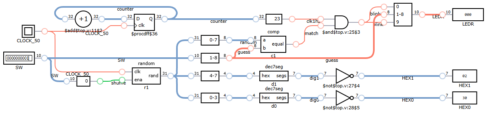

# Jogo da conversão (HEX2BIN)

O objetivo deste laboratório é implementar um jogo de conversão de hexadecimal para binário conforme a figura a seguir.

## Funcionamento

- Se `SW[0]` é acionado, números aleatórios aparecem no display, quanto ele é desligado o número escolhido fica disponível para a conversão.
- O mesmo número deve ser informado na base bináriae em `SW[8:1]`, enquanto isso acontece ele é mostrado nos LEDs `LEDR[8:1]`. 
- Se a conversão for bem sucedida, os LEDS laterais piscam (`LEDR[9]` e `LEDR[0]`).

## Critérios de avaliação

60. Implemente o funcionamento básico, instanciando os módulos `random` e `comp`, para receber a nota base para aprovação.
70. Mostre uma palavra nos demais dígitos quando o jogador acertar para receber um incremento na nota. 
100. Implemente um contador de tempon os demais dígitos para receber a nota máxima. Ele deve ser zerado enquanto embaralha, contar o tempo durante a tentativa e parar quando o jogador acerta. 