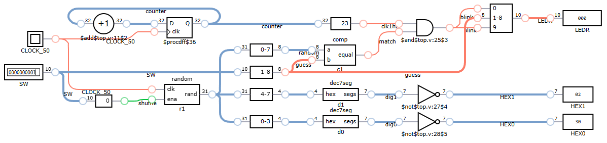

# Jogo da conversão (HEX2BIN)

O objetivo deste laboratório é implementar um jogo de conversão de hexadecimal para binário, praticando o uso de módulos sequenciais já prontos e a construção da lógica que os interliga.

## Fundamentos teóricos

### Gerador pseudoaleatório (`random`)

Circuitos digitais são determinísticos, então não existe "sorteio" de verdade — o que se usa é um **LFSR** (*Linear Feedback Shift Register*). A cada borda de clock ele desloca todos os bits para a esquerda e calcula o novo bit da direita a partir de alguns bits existentes, chamados *taps*:

**Código Verilog**

```verilog
module random (
    input clk, ena,
    output wire [30:0] rand);

    reg [30:0] lfsr = 31'h5eed_beef;

    always @(posedge clk)
        if (ena)
            lfsr = {lfsr[29:0], lfsr[16] ^~ lfsr[14] ^~ lfsr[13] ^~ lfsr[11]};

    assign rand = lfsr;
endmodule
```

Pontos importantes:
- O registrador precisa de um valor inicial (a *semente*, aqui `31'h5eed_beef`), pois um LFSR que começa zerado nunca sai do zero.
- A sequência só avança enquanto `ena` estiver em 1. É isso que o `SW[0]` controla: com a chave ligada o número muda a cada ciclo de clock (rápido demais para o olho acompanhar), e ao desligar ele congela num valor imprevisível.
- A saída tem 31 bits, mas o jogo usa apenas os 8 menos significativos.

---

### Comparador de 8 bits (`comp`)

Compara o número sorteado com o palpite do jogador e indica se são iguais:

**Código Verilog**

```verilog
module comp(
    input [7:0] a, b,
    output equal);
    assign equal = (a == b);
endmodule
```

---

### Decodificador de 7 segmentos (`dec7seg`)

Converte um valor hexadecimal de 4 bits (0–F) nos segmentos do display. São necessárias duas instâncias, uma para cada dígito do número sorteado:

**Código Verilog**

```verilog
module dec7seg (
    input  [3:0] hex,
    output reg [6:0] segs);
    always @(hex)        // gfedcba
      case (hex)         // 6543210
        4'b0000 : segs = 7'b0111111; // 0
        4'b0001 : segs = 7'b0000110; // 1
        // ...
        4'b1110 : segs = 7'b1111001; // E
        4'b1111 : segs = 7'b1110001; // F
      endcase
endmodule
```

> Na DE0-CV os displays são **ativos em nível baixo**, por isso o `top` inverte os segmentos (`assign HEX0 = ~dig0;`).

---

### Divisor de clock

O `CLOCK_50` da placa oscila a 50 MHz — rápido demais para piscar um LED de forma visível. A solução é contar bordas de clock e usar um bit alto do contador como um clock mais lento:

**Código Verilog**

```verilog
integer counter = 0;
always @(posedge CLOCK_50)
    counter <= counter + 1;
assign clk1hz = counter[23];
```

O bit 23 troca de valor a cada 2²³ ciclos, o que dá aproximadamente **3 Hz** — uma piscada bem visível.

## Funcionamento na placa



- Se `SW[0]` é acionado, números aleatórios aparecem no display; quando ele é desligado, o número escolhido fica disponível para a conversão.
- O mesmo número deve ser informado na base binária em `SW[8:1]`, e enquanto isso acontece ele é mostrado nos LEDs `LEDR[8:1]`.
- Se a conversão for bem sucedida, os LEDs laterais piscam (`LEDR[9]` e `LEDR[0]`).

## Implementação

### Etapa 1 — Lógica do jogo (`top.v`)

Todo o restante do `top` já está pronto: o divisor de clock, os dois `dec7seg`, a inversão dos segmentos e as ligações dos LEDs. Falta apenas instanciar os dois módulos fornecidos e produzir o sinal `match`:

```verilog
  wire shuffle = SW[0]; // embaralhar
  wire [7:0] random;
  wire [7:0] guess = SW[8:1]; // palpite

  // implemente a lógica do jogo aqui


  dec7seg d1(random[7:4], dig1);
  dec7seg d0(random[3:0], dig0);

  wire blink = clk1hz & match; // pisca se acertou
```

O que precisa ser ligado:
1. Uma instância de `random`, usando `CLOCK_50` como clock e `shuffle` como habilitação;
2. Os 8 bits menos significativos da saída do LFSR no barramento `random`, que já alimenta os dois displays;
3. Uma instância de `comp` comparando `random` com `guess`, gerando o sinal `match`.

Depois, carregue o código para a placa FPGA. 🚀

## Critérios de avaliação

* **6.0** - Implemente o funcionamento básico, instanciando os módulos `random` e `comp`, para receber a nota base para aprovação.
* **8.0** - Mostre uma palavra nos demais dígitos quando o jogador acertar para receber um incremento na nota.
* **10.0** - Implemente um contador de tempo nos demais dígitos para receber a nota máxima. Ele deve ser zerado enquanto embaralha, contar o tempo durante a tentativa e parar quando o jogador acerta.
