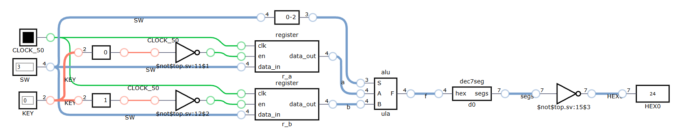

# ULA com registradores

O objetivo deste laboratório é integrar a [ULA fornecida](alu.sv) a dois [registradores](register.sv) para testar seu funcionamento.

## Funcionamento

- `SW[4:0]` é usado para informar os valores de A, B e também para selecionar a operação da ULA;
- `KEY[1:0]` é usado para *carregar* os valores A e B respectivamente (lembre-se que eles são invertidos);
- O resultado deve aparecer no *display* continuamente.

## Critérios de avaliação

* **6.0** - Implemente o funcionamento básico para simulação.
* **8.0** - Implemente o funcionamento básico na placa.
* **10.0** - Mostre os valores de A e B no display quando a carga é feita em cada um deles. 
