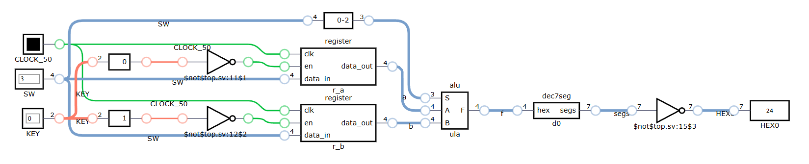

# ULA com registradores

O objetivo deste laboratório é integrar a [ULA fornecida](alu.sv) a dois [registradores](register.sv) para testar seu funcionamento, primeiro por simulação e depois na placa.

## Fundamentos teóricos

### Unidade Lógica e Aritmética (`alu`)

Uma ULA reúne várias operações em um único bloco e usa um seletor para escolher qual delas aparece na saída. Aqui o seletor `S` tem 3 bits, portanto 8 operações sobre os operandos `A` e `B` de 4 bits:

| `S` | Operação | | `S` | Operação |
|:---:|:---------|-|:---:|:---------|
| `000` | `0000` (zero) | | `100` | `A ^ B` |
| `001` | `B - A`       | | `101` | `A \| B` |
| `010` | `A - B`       | | `110` | `A & B` |
| `011` | `A + B`       | | `111` | `1111` |

**Código Verilog**

```verilog
module alu(S, A, B, F);
    input [2:0] S;
    input [3:0] A, B;
    output reg [3:0] F;

    always @(S, A, B)
        case (S)
            0: F = 4'b0000;
            1: F = B - A;
            // ...
            6: F = A & B;
            7: F = 4'b1111;
         endcase
endmodule
```

Repare que a ULA é **puramente combinacional**: a saída acompanha as entradas o tempo todo, sem clock.

---

### Registrador de 4 bits (`register`)

É o registrador que dá "memória" ao circuito. Sem ele não haveria como informar dois operandos usando o mesmo conjunto de switches — o valor de `A` seria perdido assim que os switches fossem mudados para `B`.

A cada borda de subida do clock, o registrador copia a entrada para a saída **apenas se `en` estiver ativo**; caso contrário, mantém o valor guardado:

**Código Verilog**

```verilog
module register(clk, en, data_in, data_out);

  parameter bits = 4;

  input clk, en;
  input [bits-1:0] data_in;
  output [bits-1:0] data_out;

  reg [bits-1:0] data_out;

  always @ (posedge clk)
    if (en)
      data_out <= data_in;

endmodule
```

O `parameter bits = 4` permite reaproveitar o mesmo módulo com outras larguras, mas aqui o valor padrão já serve.

---

### Decodificador de 7 segmentos (`dec7seg`)

Converte o resultado de 4 bits (0–F) nos segmentos do display. Só é necessário na etapa da placa:

**Código Verilog**

```verilog
module dec7seg (
    input  [3:0] hex,
    output reg [6:0] segs);
    always @(hex)        // gfedcba
      case (hex)         // 6543210
        4'b0000 : segs = 7'b0111111; // 0
        4'b0001 : segs = 7'b0000110; // 1
        // ...
        4'b1110 : segs = 7'b1111001; // E
        4'b1111 : segs = 7'b1110001; // F
      endcase
endmodule
```

## Funcionamento na placa



- `SW[3:0]` é usado para informar os valores de A, B e também para selecionar a operação da ULA (nesse caso apenas `SW[2:0]`);
- `KEY[1:0]` é usado para *carregar* os valores A e B respectivamente (lembre-se que eles são invertidos);
- O resultado deve aparecer no *display* continuamente.

Repare que **A e B têm 4 bits cada** — os mesmos quatro switches são usados para as três coisas, mas em **momentos diferentes**. São os registradores que tornam isso possível: cada valor é capturado e guardado, liberando os switches para o próximo uso.

| Momento | `SW[3:0]` | Você pressiona | Efeito |
|:-------:|:----------|:--------------:|:-------|
| 1 | valor de **A** | `KEY[0]` | `r_a` guarda A |
| 2 | valor de **B** | `KEY[1]` | `r_b` guarda B |
| 3 | operação **S** em `SW[2:0]` | — | o resultado aparece no display |

No momento 3 os switches mudam de novo, mas `a` e `b` continuam parados: com `en` inativo, os registradores seguram o valor capturado. O bit `SW[3]` fica sem uso nessa etapa, já que o seletor precisa de apenas 3 bits.

Sem os registradores seriam necessários 4 + 4 + 3 = **11 switches** ligados ao mesmo tempo. Com eles, 4 switches dão conta das três funções — é essa a ideia central do laboratório.

## Implementação

### Etapa 1 — Simulação (`top.sv`)

Complete o `top` instanciando os dois registradores e a ULA. Nesta etapa a saída é o próprio valor de 4 bits, para que o *test bench* possa conferi-lo:

```verilog
module top(
  input CLOCK_50,
  input [3:0] SW,
  input [1:0] KEY,
  output [3:0] f); 	//simulacao
  //output [6:0] HEX0);	//implementacao

  wire [3:0] a, b;

  // instancie os registradores e a ULA aqui

endmodule
```

Para simular:

```bash
./run.sh
```

> **Na simulação as chaves não são invertidas.** O *test bench* aciona `pb = 2'b01` para carregar A e `pb = 2'b10` para carregar B, ou seja, em nível **alto**. Use `KEY[0]` e `KEY[1]` diretamente aqui — a inversão só entra na Etapa 2.

O arquivo `values.tv` traz um único caso de teste (`0_0_0_0`), que exercita apenas `S = 000` — e nessa operação a saída é zero independentemente de A e B. Ou seja, ele passa até em um projeto sem registrador nenhum. **Acrescente seus próprios casos**, no formato `s_a_b_f`:

```
3_2_3_5    # A + B  ->  2 + 3 = 5
4_f_0_f    # A ^ B  ->  f ^ 0 = f
6_c_a_8    # A & B  ->  c & a = 8
1_1_5_4    # B - A  ->  5 - 1 = 4
```

### Etapa 2 — Implementação na placa (`top.sv`)

Para levar o projeto à placa, três coisas mudam:

1. **A saída** — troque os comentários nas portas: em vez de `output [3:0] f`, use `output [6:0] HEX0`, e acrescente um `dec7seg` para converter o resultado.
2. **Os displays são ativos em nível baixo** — inverta os segmentos antes de ligá-los em `HEX0` (`assign HEX0 = ~segs;`).
3. **As chaves `KEY` também são ativas em nível baixo** — pressionada vale 0. Inverta o sinal na habilitação dos registradores (`~KEY[0]` e `~KEY[1]`), senão eles carregariam o tempo todo e só parariam enquanto o botão estivesse pressionado.

Depois, carregue o código para a placa FPGA. 🚀

## Critérios de avaliação

* **6.0** - Implemente o funcionamento básico para simulação.
* **8.0** - Implemente o funcionamento básico na placa.
* **10.0** - Mostre os valores de A e B no display quando a carga é feita em cada um deles.
