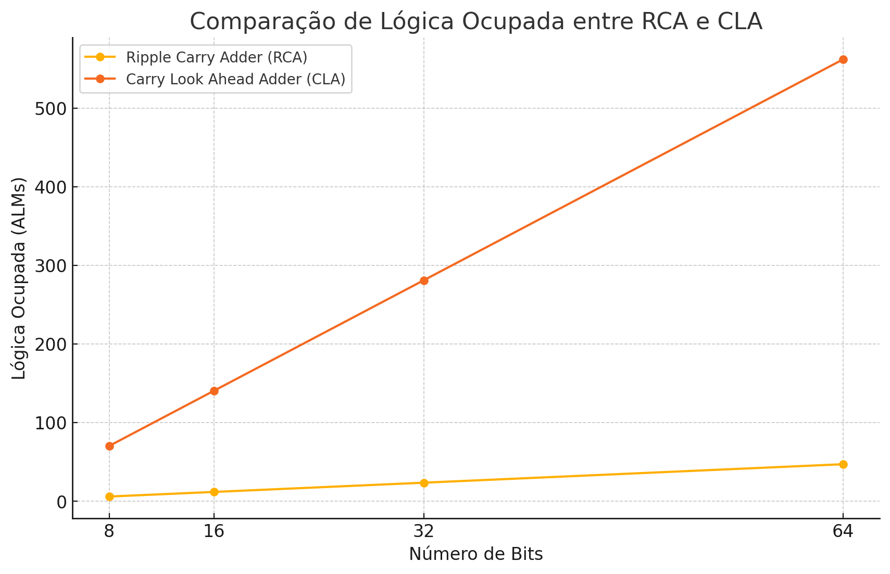

# Simulação temporal 

## Descrição

Este laboratório consiste na comparação de dois tipos de somadores em circuitos digitais: o Ripple Carry Adder (RCA) e o Carry Lookahead Adder (CLA). O objetivo é analisar a eficiência de tempo de ambos os módulos por meio da simulação que considera o atraso de propagação do sinal elétrico no dispositivo escolhido. 

## Módulos a serem testados

- Ripple Carry Adder (RCA): Este módulo realiza a adição de dois números binários, propagando o carry de bit a bit. Embora seja simples de implementar, sua eficiência diminui à medida que aumenta o número de bits.
  
- Carry Lookahead Adder (CLA): Este módulo melhora a velocidade da adição ao calcular os carries de forma antecipada, permitindo uma adição mais rápida em comparação com o RCA.

## Resultados Esperados

O desempenho dos dois módulos deve ser testado e os tempos de execução registrados. O gráfico abaixo ilustra a comparação dos tempos de execução para diferentes larguras de bits.

## Gráfico de comparação do atraso

## Diferença nos atrasos 

Aqui podemos observar, como exemplo, que utilizando 32 bits como parâmetro de largura, obtemos um atraso maior no módulo RCA em relação ao módulo CLA, o que corrobora com os dados obtidos no gráfico acima.

## Comparação de ocupação (ALMs)

