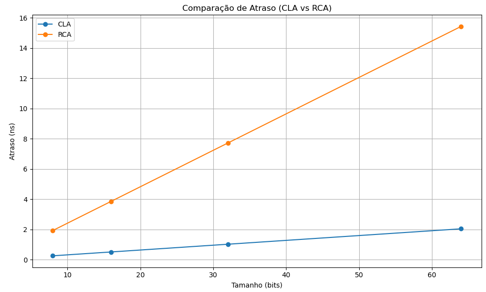
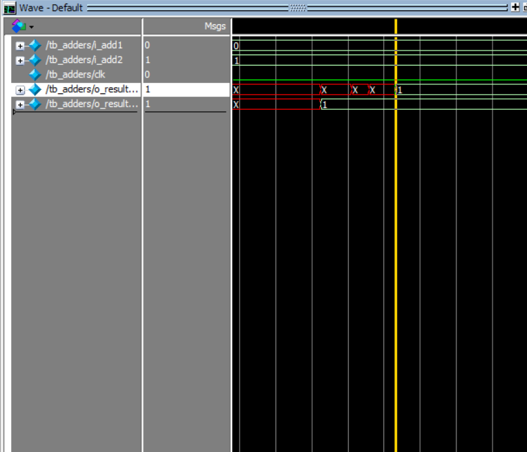
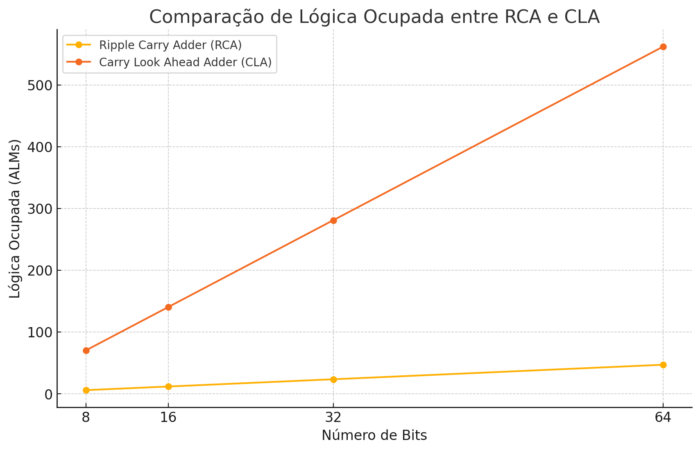

### Desafio: Comparação entre RCA e CLA
### Antonio Adolfo Geraldino Bernardo RA: 828561
 

## Descrição
Este projeto consiste na implementação e comparação de dois tipos de adição em circuitos digitais: o Ripple Carry Adder (RCA) e o Carry Lookahead Adder (CLA). O objetivo é analisar a eficiência de tempo de ambos os módulos.

### Módulos Implementados

- Ripple Carry Adder (RCA): Este módulo realiza a adição de dois números binários, propagando o carry de bit a bit. Embora seja simples de implementar, sua eficiência diminui à medida que aumenta o número de bits.
  
- Carry Lookahead Adder (CLA): Este módulo melhora a velocidade da adição ao calcular os carries de forma mais antecipada, permitindo uma adição mais rápida em comparação com o RCA.

## Resultados Esperados
O desempenho dos dois módulos foi testado e os tempos de execução foram registrados. O gráfico abaixo ilustra a comparação dos tempos de execução para diferentes larguras de bits.

## Gráfico de Comparação de atraso - utilizando dados do ModelSim Altera

## Print do ModelSim Altera - módulos trabalhando com 32 bits (exemplo)

Aqui podemos observar, como exemplo, que utilizando 32 bits como parâmetro de largura, obtemos um atraso de 1,022 ns do módulo RCA em relação ao módulo CLA, o que corrobora com os dados obtidos no gráfico acima.

## Gráfico de Comparação de Lógica Utilizada - utilizando dados do Quartus II - Fitter (Resource Utilization by Entity)

Podemos perceber que, enquanto o módulo RCA utiliza 23.5 ALMs para 32 bits, o módulo CLA utiliza 281, o que retifica os dados observados no gráfico acima.
